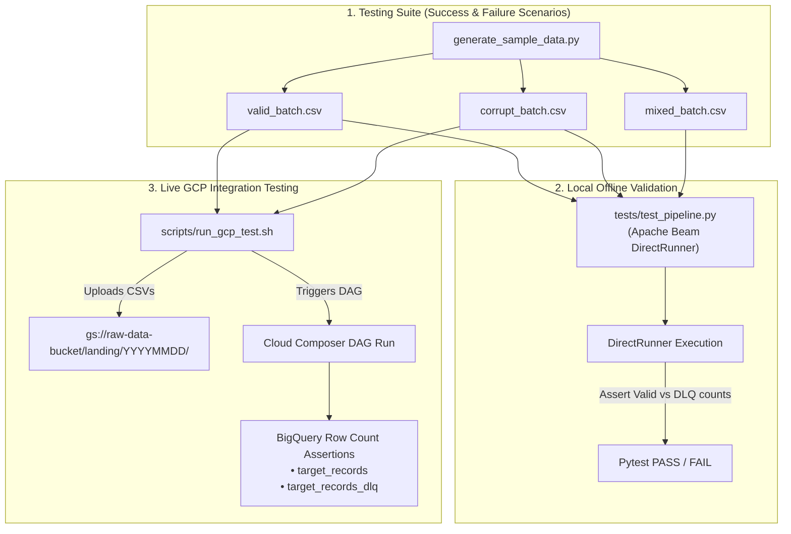

# GCP Production Data Ingestion Architecture Plan (v3.0)
**GCS to BigQuery Batch Pipeline with End-to-End Testing & Deployment Framework**

---

## 1. Executive Summary & Design Goals

This architecture document details a robust, scalable, and resilient batch data ingestion pipeline on Google Cloud Platform (GCP) with **production-grade logging, monitoring, alerting, data quality observability, and an automated testing framework for success and failure scenarios**.

### Key Architectural Pillars
* **Orchestration**: Cloud Composer (Apache Airflow) using non-blocking **Deferrable Sensors**, **Failure/SLA Callbacks**, and **Post-ETL Quality Audit Tasks**.
* **Transformation & Telemetry**: Dataflow (Apache Beam) Flex Template with **Beam Custom Metric Counters** (`processed_records`, `valid_records`, `dlq_records`) and structured JSON logging.
* **Error Resilience & Quality Auditing**: **Dead-Letter Queue (DLQ)** pattern for schema/data errors, monitored via hybrid BigQuery quality threshold tasks and Cloud Monitoring alerts.
* **Dual Testing Framework**:
  * **Local PyTest Test Suite (`tests/test_pipeline.py`)**: Offline verification using Beam `DirectRunner`.
  * **GCP Integration Test Harness (`scripts/run_gcp_test.sh`)**: End-to-end verification uploading sample files to GCS, running Composer DAG, and asserting BigQuery target & DLQ row counts.

---

## 2. End-to-End Testing & Deployment Architecture



---

## 3. Testing & Scenario Matrix

| Scenario | Input Dataset | Expected Behavior | Target Table Count | DLQ Table Count | Audit Task Outcome |
| :--- | :--- | :--- | :--- | :--- | :--- |
| **Success Scenario** | `valid_batch.csv` | All rows clean; 0 errors | 100% of input rows | 0 rows | **PASSED** |
| **Failure / DLQ Scenario** | `corrupt_batch.csv` | All rows fail parsing/validation; routed to DLQ | 0 rows | 100% of input rows | **FAILED** (DLQ threshold breached) |
| **Mixed Scenario** | `mixed_batch.csv` | Valid rows ingested; invalid rows routed to DLQ | Valid row count | Invalid row count | **PASSED** (If DLQ count <= MAX_DLQ_THRESHOLD) |

---

## 4. Repository Structure & Deliverables

```
.
├── dags/
│   └── gcs_to_bq_dag.py        # Composer DAG with deferrable sensor, callbacks & DLQ quality check
├── pipeline/
│   ├── main.py                 # Apache Beam Python ETL script with custom counters & JSON logging
│   ├── Dockerfile              # Flex Template launcher Dockerfile
│   ├── requirements.txt        # Beam SDK & GCP dependencies
│   └── metadata.json           # Dataflow Flex Template spec parameters
├── sample_data/
│   ├── generate_sample_data.py # Dynamic CSV test batch generator
│   ├── valid_batch.csv         # 100% valid test dataset
│   ├── corrupt_batch.csv       # 100% malformed test dataset
│   └── mixed_batch.csv         # Mixed valid & invalid test dataset
├── tests/
│   └── test_pipeline.py        # PyTest suite running DirectRunner for success & failure scenarios
├── sql/
│   └── create_tables.sql       # BigQuery schema setup for Target, DLQ & Logging datasets
├── scripts/
│   ├── setup_gcp_resources.sh  # Automated GCP bucket & BQ dataset setup script
│   ├── build_and_deploy.sh     # Automated build & deployment script
│   └── run_gcp_test.sh         # End-to-end GCP integration test runner
├── monitoring/
│   └── dashboard.json          # Cloud Monitoring unified dashboard JSON configuration
└── README.md                   # Full user setup, local test, & GCP integration guide
```

---

## 5. Next Steps

1. Generate `sample_data/` files and generator script.
2. Build `tests/test_pipeline.py` pytest harness.
3. Build `scripts/setup_gcp_resources.sh` and `scripts/run_gcp_test.sh`.
4. Run local pytest suite to verify all test cases pass.
